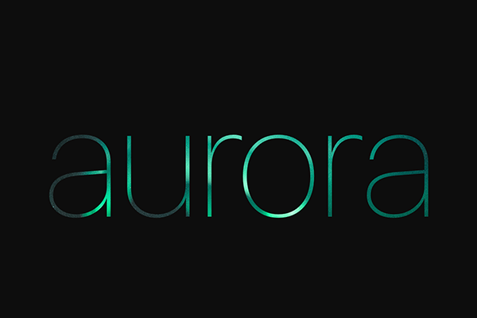

# Playgrounds

[Swift Playgrounds](https://developer.apple.com/swift-playgrounds/) are the perfect place to experiment with an idea. They are quick, responsive, and more importantly, use the same frameworks you have available when programming for iOS.

## TypeMask

Masking an image using a `UILabel`.
